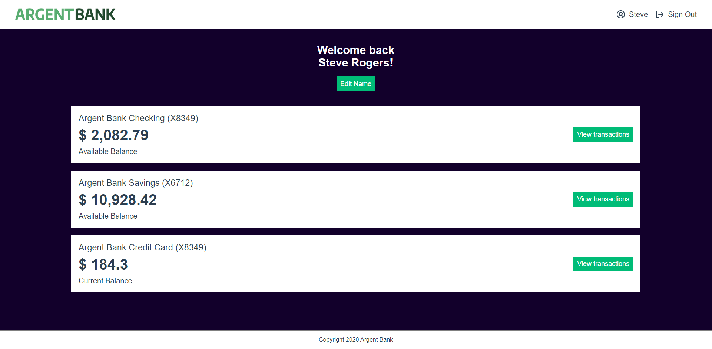

# Formation Développeur d'application - JavaScript React

## 📎 Projet 13 : Argent Bank - Utilisez une API pour un compte utilisateur bancaire avec React



## Installation :

Installer les dépendances dans chaque dossier avec la commande `npm install`\
Attention le backend nécessite la `version 12 de Node.js`

Créer un fichier `.env` à la racine du dossier client:
```
VITE_REACT_APP_BASE_URL = "http://localhost:3001/api/v1"
```

Créer un fichier `.env` à la racine du dossier api:
```
DATABASE_USER = "santa"
DATABASE_PASSWORD = "NqZamtCvB49XwSqI"
DATABASE_NAME = "Cluster1"
```

Lancer les serveurs dans chaque dossier avec la commande `npm start`

## Technologies :

- React
- Redux
- SASS


## Tester le projet :

```terminal
git clone https://github.com/Cyril-Develop/ArgentBank.git
```